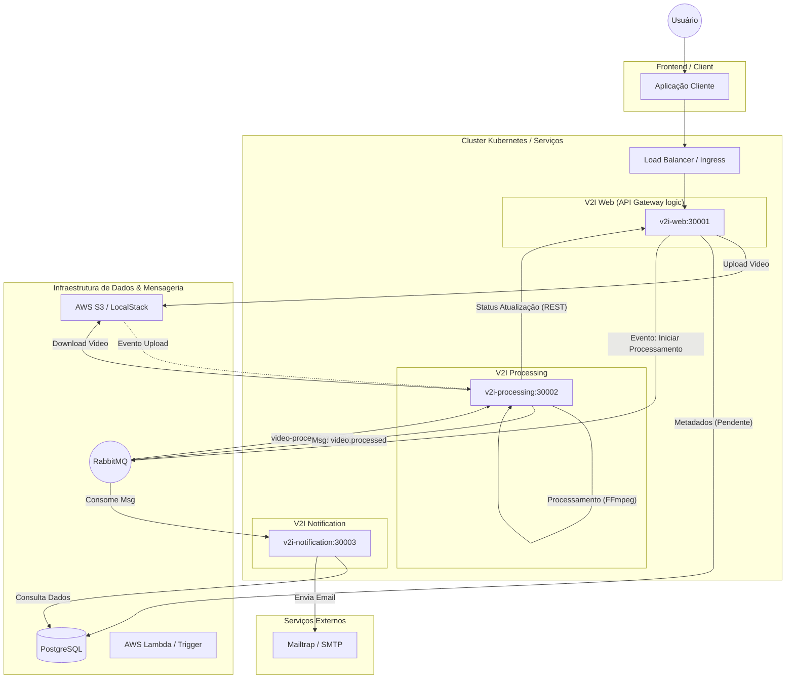

# Documentação da Arquitetura - Projeto Hackaton V2I

## 1. Visão Geral
O projeto **V2I (Video to Image)** é uma solução baseada em microsserviços destinada ao processamento de vídeos para extração de imagens (frames). A arquitetura foi desenhada para ser escalável, resiliente e desacoplada, utilizando comunicação assíncrona via mensageria.

## 2. Arquitetura do Sistema

A solução é composta por três microsserviços principais que interagem entre si, suportados por serviços de infraestrutura como RabbitMQ (mensageria) e PostgreSQL (persistência).

## 3. Microsserviços

### 3.1. V2I Web (`v2i-web`)
*   **Porta:** `30001`
*   **Responsabilidade:** Interface principal com o usuário e gerenciamento de metadados.
*   **Fluxo:**
    1.  Recebe o vídeo do usuário.
    2.  Salva os metadados no PostgreSQL (Status: `PENDING`).
    3.  Realiza o upload do arquivo binário para o Bucket S3 (`v2i-bucket`).
    4.  Publica evento de processamento no RabbitMQ.
    5.  Fornece endpoints para que o processador atualize o status do vídeo (`PROCESSING`, `SUCCESS`, `ERROR`).

### 3.2. V2I Processing (`v2i-processing`)
*   **Porta:** `30002`
*   **Responsabilidade:** Core de processamento de vídeo.
*   **Acionamento:** É acionado via **Webhook/REST** (S3 Event) quando um novo arquivo chega no S3.
*   **Fluxo:**
    1.  Recebe notificação de novo evento de processamento do RabbitMQ.
    2.  Notifica `v2i-web` que o processamento iniciou.
    3.  Baixa o vídeo do S3.
    4.  Extrai frames do vídeo (gera imagens).
    5.  Gera um arquivo `.zip` com os frames e faz upload de volta para o S3 (ou stream).
    6.  Notifica `v2i-web` de conclusão.
    7.  Publica mensagem `video.processed` no **RabbitMQ** para fins de notificação.

### 3.3. V2I Notification (`v2i-notification`)
*   **Porta:** `30003`
*   **Responsabilidade:** Serviço dedicado a comunicar o usuário final sobre a conclusão do processamento.
*   **Principais Funcionalidades:**
    *   Escuta eventos de finalização de processamento.
    *   Envia e-mails transacionais (configurado atualmente com Mailtrap).

## 4. Stack Tecnológica

| Componente | Tecnologia | Versão (Ref) |
| :--- | :--- | :--- |
| **Linguagem** | Java | 21 |
| **Framework** | Spring Boot | 4.0.2 |
| **Banco de Dados** | PostgreSQL | Latest |
| **Mensageria** | RabbitMQ | Latest |
| **Armazenamento** | AWS S3 (Prod) / LocalStack (Dev) | SDK 2.x |
| **Containerização** | Docker | - |
| **Orquestração** | Kubernetes (K8s) | v1 |

## 5. Infraestrutura e DevSecOps

### Armazenamento de Dados
*   Utiliza **PostgreSQL** como banco relacional centralizado para persistência de metadados de vídeos, status de processamento e logs de notificação.

### Fila de Mensagens
*   **RabbitMQ** atua como backbone de comunicação assíncrona, desacoplando o recebimento do vídeo (Web) do seu processamento (Processing) e da notificação (Notification). Isso permite que o sistema escale o processamento independentemente da taxa de upload.

### Integração AWS
*   O sistema utiliza o **AWS S3** para armazenar os arquivos brutos (vídeos) e os resultados processados.
*   Em ambiente local (`dev`), é utilizado o **LocalStack** para simular os serviços da AWS, garantindo paridade entre desenvolvimento e produção.

### Monitoramento
*   Todos os serviços possuem **Spring Boot Actuator** habilitado (`health`, `info`, `metrics`), permitindo integração com ferramentas de monitoramento como Prometheus/Grafana.

### Segurança
*   O projeto `v2i-web` inclui dependências do **Spring Security**, indicando controle de acesso e autenticação nas bordas da aplicação.

## 6. Configurações de Ambiente (Destaques)

Cada serviço possui seu próprio `application.properties` ma gerenciado via variáveis de ambiente para facilitar o deploy em contêineres:

*   **Database:** `SPRING_DATASOURCE_URL`, `POSTGRES_USER`, `POSTGRES_PASSWORD`.
*   **RabbitMQ:** `RABBITMQ_USER`, `RABBITMQ_PASSWORD`, host configurado para `host.minikube.internal` (ambiente K8s local).
*   **AWS:** Região `us-east-1`, com chaves de acesso injetáveis.
*   **Mail:** Configurado via SMTP (Mailtrap) no serviço de notificação.
